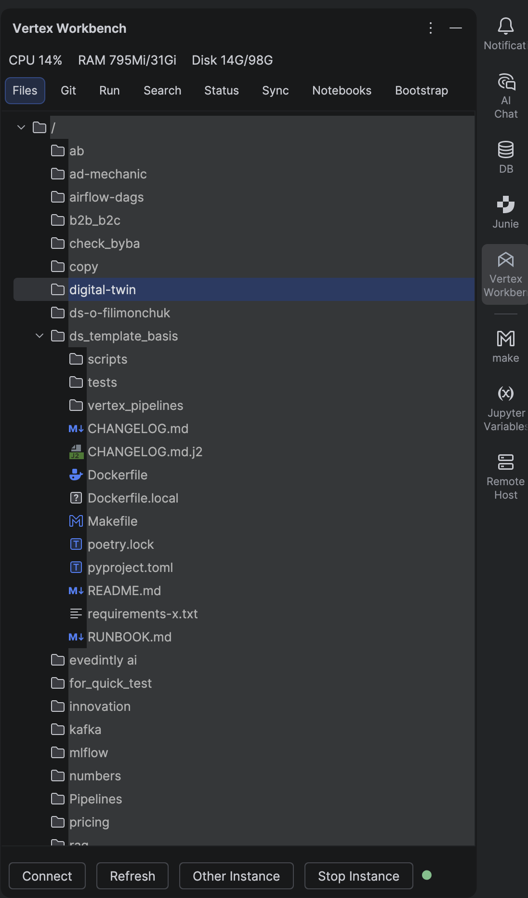
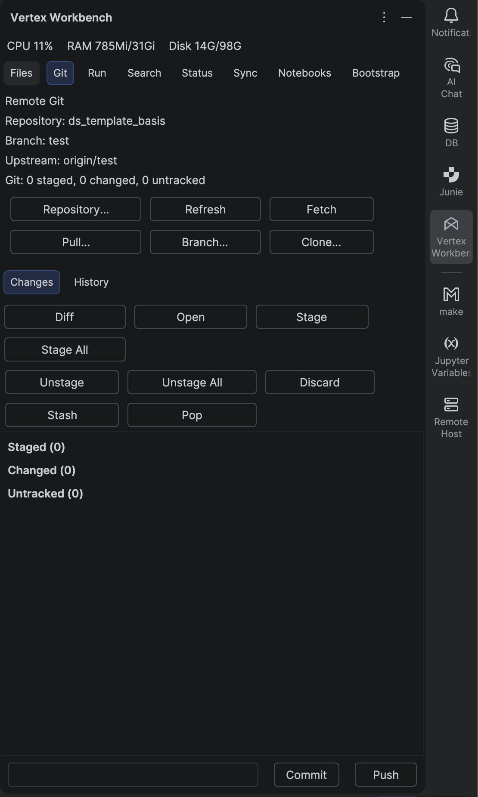
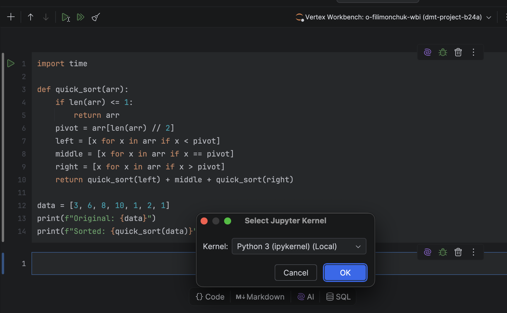
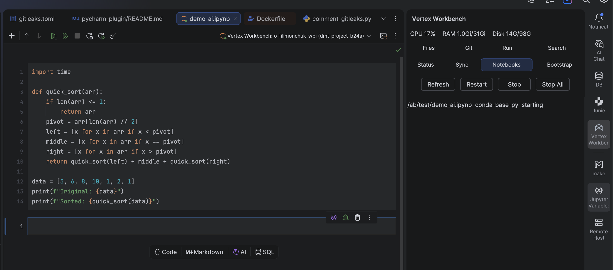
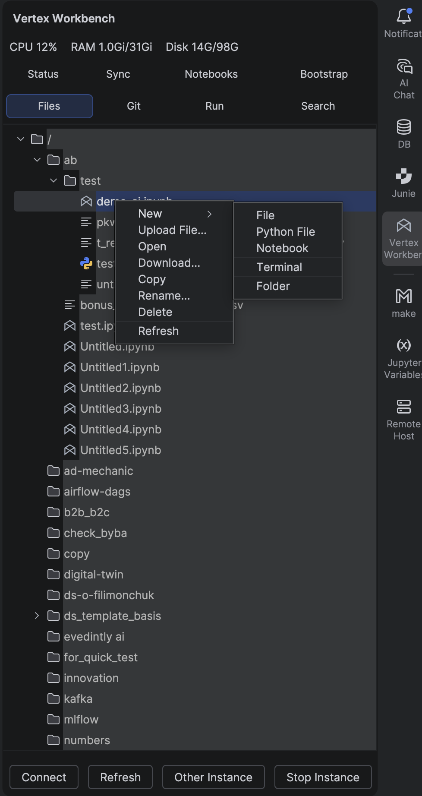

# Workbench Connector for GCP — PyCharm Plugin

[](https://github.com/Apachaika/pycharm-gcp-workbench/releases/latest)
[](https://github.com/Apachaika/pycharm-gcp-workbench/releases)
[](https://github.com/Apachaika/pycharm-gcp-workbench/actions/workflows/ci.yml)
[](LICENSE)
[](https://www.jetbrains.com/pycharm/)

<!--
  After the plugin is approved on JetBrains Marketplace, uncomment the two
  badges below (and the marketplace link in the Download table). They query
  the Marketplace API directly (no GitHub-API rate limits):

  [](https://plugins.jetbrains.com/plugin/dev.vertexworkbench.connector)
  [](https://plugins.jetbrains.com/plugin/dev.vertexworkbench.connector)
-->


Browse files, edit notebooks, run cells on the remote kernel, open Workbench terminals, and drive remote Git — all from PyCharm Professional, against your **Google Cloud Vertex AI Workbench** instances. No JupyterLab browser tab required.



> Independent, unofficial integration. "Google Cloud", "Vertex AI" and "Workbench" are trademarks of Google LLC. This plugin is not affiliated with, endorsed by, or sponsored by Google LLC or JetBrains s.r.o.

## Download

Grab the latest signed ZIP directly from GitHub Releases — no Marketplace account needed:

| PyCharm Professional | Download |
|----------------------|----------|
| **2025.3.x** (`sinceBuild=253`) | [vertex-workbench-pycharm-pycharm-2025.3.x-build-253.zip](https://github.com/Apachaika/pycharm-gcp-workbench/releases/latest/download/vertex-workbench-pycharm-pycharm-2025.3.x-build-253.zip) |
| **2026.1.x** (`sinceBuild=261`) | [vertex-workbench-pycharm-pycharm-2026.1.x-build-261.zip](https://github.com/Apachaika/pycharm-gcp-workbench/releases/latest/download/vertex-workbench-pycharm-pycharm-2026.1.x-build-261.zip) |

Older versions and full changelogs: [all releases](https://github.com/Apachaika/pycharm-gcp-workbench/releases).

**Install:** PyCharm → **Settings → Plugins → ⚙ → Install Plugin from Disk…** → pick the ZIP that matches your IDE.

## Requirements

- **PyCharm Professional** with bundled plugins enabled:
  - **Python** (`PythonCore`, `Pythonid`, `com.intellij.modules.python`)
  - **Jupyter** (`intellij.jupyter`, `com.intellij.notebooks.core`)
  - **Terminal** (`org.jetbrains.plugins.terminal`)
- **Google Cloud CLI** (`gcloud`) installed and authenticated with `gcloud auth login`.
- Access to the Vertex AI Workbench Notebooks API and the selected Workbench instance.
- macOS, Linux, or Windows. The plugin auto-detects common `gcloud` locations and lets you override the path in **Settings → Tools → Vertex Workbench**.

## Quick start

1. Install Google Cloud CLI and run `gcloud auth login`.
2. PyCharm: **Tools → Vertex Workbench → Connect** (or open the **Vertex Workbench** Tool Window).
3. Pick a GCP project and Workbench instance. You can enable auto-connect for that instance.
4. Browse remote files in the Tool Window. Double-click any file to open it in PyCharm — saving uploads it back to Workbench.
5. Open `.ipynb` files from the Workbench tree and run cells through the configured WBI Jupyter runtime.
6. Open the **Git** tab after selecting a repo folder in the tree for branch, status, history, diff, stash, commit, pull, push, clone, and checkout.
7. Use the **Run**, **Search**, **Status**, **Sync**, **Notebooks**, and **Bootstrap** tabs for remote commands, `rg`/fallback search, Workbench health, pinned folder sync, kernel-session management, and project initialization.

## Features

### Remote Git, end-to-end



Status, branch list (local + remote), history, diff, stage / unstage, commit, pull (with explicit remote branch picker), push, fetch, stash, clone, and branch checkout — all executed on the Workbench instance, surfaced as a normal PyCharm panel.

### Notebooks on the remote kernel



Workbench notebooks open in PyCharm's bundled Jupyter editor and bind to a remote kernel running on the Workbench VM. Already-running kernels are reused automatically; opening a notebook from the tree never falls back to a local Python kernel.



The Workbench file tree shows a green dot on `.ipynb` files whose kernel is currently alive on the remote (refreshed every 30s). The **Notebooks** tab lists active sessions with idle hints and an **Attach in PyCharm** button.

### File management without leaving the IDE



Right-click any node in the remote tree for **New File / New Folder / Upload / Download / Rename / Copy / Delete**. Two-way sync keeps mapped files fresh while the connection is live. A compact CPU / RAM / Disk strip at the top of the tool window shows live instance health.

## Two build lines, one plugin id

The plugin is published as **two compatibility versions of the same plugin id** (`dev.vertexworkbench.pycharm`) because the bundled `intellij.jupyter` API diverged between PyCharm 2025.3.x and 2026.1.x:

| Build line | Source root | Target IDE | `since`–`until` |
|------------|-------------|------------|-----------------|
| 2025.3.x | this repo root | PyCharm Professional 2025.3.x | `253` – `260.*` |
| 2026.1.x | [`pycharm-plugin-2026.1/`](pycharm-plugin-2026.1/) | PyCharm Professional 2026.1.x | `261` – `261.*` |

Bug-fix and feature commits land in **both** trees in lockstep — see [`.cursor/skills/dual-version-maintenance/`](.cursor/skills/dual-version-maintenance/).

## Build from source

**2025.3.x** (this folder):

```bash
export JAVA_HOME='/path/to/PyCharm.app/Contents/jbr/Contents/Home'
./scripts/build-release.sh
# or:
./gradlew test buildPlugin \
  -PtargetPyCharmVersion=2025.3.5 \
  -PartifactSuffix=pycharm-2025.3.x-build-253
```

**2026.1.x**:

```bash
cd pycharm-plugin-2026.1
export JAVA_HOME='/path/to/PyCharm.app/Contents/jbr/Contents/Home'
./gradlew test buildPlugin \
  -PtargetPyCharmVersion=2026.1.2 \
  -PartifactSuffix=pycharm-2026.1.x-build-261
```

Built ZIPs land in `build/distributions/`. For an IDE sandbox: `./gradlew runIde` (Java 17+ required; the build script auto-picks the JBR from PyCharm). Run the IntelliJ Plugin Verifier without producing a new ZIP: `./gradlew verifyPlugin`.

## Releasing

Releases are **fully automated by conventional commits** via [.github/workflows/auto-release.yml](.github/workflows/auto-release.yml). You do not edit the version, the changelog, or the Marketplace "What's New" text. You write good commit subjects and push to `main` — the bot does the rest.

### Quick rules

| Commit subject prefix | Bump | Becomes a release? |
|---|---|---|
| `fix:` / `perf:` | patch (`0.3.49` → `0.3.50`) | yes |
| `feat:` | minor (`0.3.49` → `0.4.0`) | yes |
| `feat!:` *or* `BREAKING CHANGE:` in commit body | major (`0.3.49` → `1.0.0`) | yes |
| `chore:` / `docs:` / `ci:` / `refactor:` / `test:` / `style:` | none | no |

What you write after the prefix is what users see in JetBrains Marketplace → *What's New* and in [`CHANGELOG.md`](CHANGELOG.md) — write it for end users.

```bash
# Make a change, commit with a conventional subject, push.
git add -A
git commit -m "fix: clear deprecated FileEditor.disposeEditor warning"
git push origin main

# ...that's it. Within ~5 minutes the plugin appears as v0.3.50 on
# JetBrains Marketplace AND as a GitHub Release with both ZIPs attached.
```

### What the workflow does on each push

1. Scans every commit subject since the last `v*` tag and decides the bump type. If no `fix:` / `feat:` / `perf:` commits — exits with a "skipped" notice (no release).
2. Bumps `val pluginBaseVersion = "..."` in **both** `build.gradle.kts` files atomically via `sed`.
3. Runs [`scripts/update-release-notes.py`](scripts/update-release-notes.py) to insert a `<h3>X.Y.Z</h3>` block at the top of `changeNotes` in both `build.gradle.kts` files, plus a matching `## [X.Y.Z] — DATE` section in [`CHANGELOG.md`](CHANGELOG.md) (grouped into Added / Fixed / Performance from commit prefixes).
4. Commits the bump back to `main` as `github-actions[bot]` with `chore(release): X.Y.Z [skip auto-release]` (three independent loop guards prevent re-trigger).
5. Builds both ZIPs (2025.3.x publishes as `X.Y.Z`, 2026.1.x publishes as `X.Y.Z-261` — see the "Marketplace version suffix" section in [.cursor/skills/dual-version-maintenance/SKILL.md](.cursor/skills/dual-version-maintenance/SKILL.md) for the why).
6. Uploads both ZIPs to JetBrains Marketplace via `./gradlew publishPlugin`. A publish failure for either line is surfaced as an `::error` annotation on the Actions run page but does NOT block the GitHub Release.
7. Renames the ZIPs to stable filenames, extracts the freshly-generated `## [X.Y.Z]` block from `CHANGELOG.md` as the release body, creates the `vX.Y.Z` tag, and opens the GitHub Release with both ZIPs attached.

### Manual / fallback release

[.github/workflows/manual-release.yml](.github/workflows/manual-release.yml) is the old "read version from `build.gradle.kts`, build, publish" workflow trimmed to `workflow_dispatch` only. Open the **Actions** tab → **Manual release (fallback)** → **Run workflow** when you need to:

- Re-release the same version after a botched publish — tick `force`.
- Ship a GitHub-only release during a Marketplace outage — tick `skip_marketplace`.
- Recover from an `auto-release.yml` mid-flight failure (bump commit is on `main` but no Release was created).

Every push and PR also runs the full test matrix via [.github/workflows/ci.yml](.github/workflows/ci.yml).

### Required GitHub Actions secrets (set once)

Open <https://github.com/Apachaika/pycharm-gcp-workbench/settings/secrets/actions> → **New repository secret** and add:

| Secret | Required? | Where to get it |
|--------|-----------|-----------------|
| `RELEASE_PAT` | **Yes** (for auto-release) | <https://github.com/settings/personal-access-tokens/new> → fine-grained PAT scoped to this repo with **Contents: Read and write**, **Workflows: Read and write**, **Metadata: Read-only**. The built-in `GITHUB_TOKEN` cannot push commits that re-trigger other workflows — that's why we need a PAT. |
| `JETBRAINS_MARKETPLACE_TOKEN` | Yes (for Marketplace publish) | <https://plugins.jetbrains.com/author/me/tokens> → permanent token with **Marketplace: upload plugins** scope |
| `JETBRAINS_CERTIFICATE_CHAIN` | Optional (for signed ZIPs) | <https://plugins.jetbrains.com/docs/intellij/plugin-signing.html> |
| `JETBRAINS_PRIVATE_KEY` | Optional | (same) |
| `JETBRAINS_PRIVATE_KEY_PASSWORD` | Optional | (same) |

Without `RELEASE_PAT`, `auto-release.yml` fails at the push-back step — the bump commit is created locally in the runner but cannot be pushed to `main`. Without `JETBRAINS_MARKETPLACE_TOKEN`, the Marketplace upload step is skipped with a notice but the GitHub Release is still created.

## Privacy

The plugin runs entirely on your machine, talks only to Google Cloud endpoints you select, and **never persists Google access tokens** — it always calls `gcloud auth print-access-token` on demand. Full data-flow description: [docs/PRIVACY.md](docs/PRIVACY.md). Report a security issue privately per [SECURITY.md](SECURITY.md).

## Documentation

- [Architecture](docs/ARCHITECTURE.md) — services, threading, network paths
- [Features, versions & fixes](docs/FEATURES.md) — what's implemented per module
- [Changelog](CHANGELOG.md) — per-version notes
- [Privacy policy](docs/PRIVACY.md)

## License

[Apache License 2.0](LICENSE). The Google and JetBrains trademarks remain the property of their respective owners.
