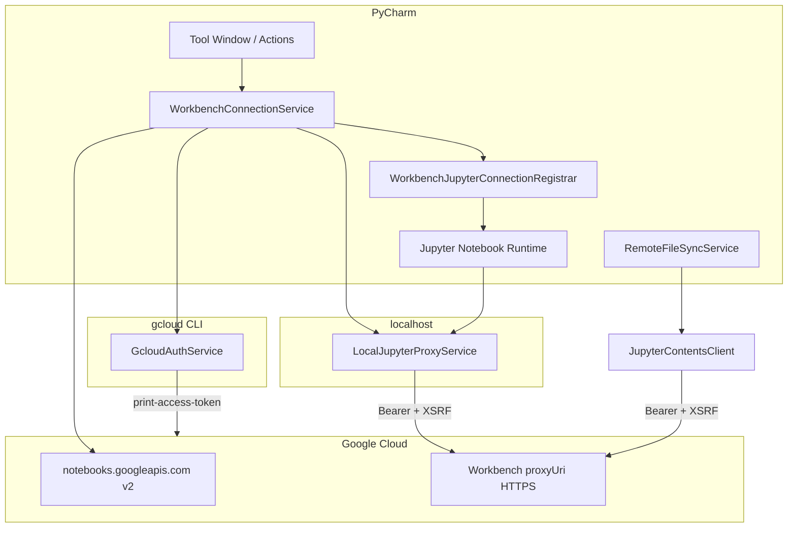

# Vertex Workbench Connector — архитектура

Плагин `dev.vertexworkbench.pycharm` связывает PyCharm Professional с Jupyter на **Vertex AI Workbench** через `gcloud` OAuth. Файлы на VM доступны через **Jupyter Contents API**; выполнение ноутбуков — через встроенный модуль **`intellij.jupyter`**. Локальный прокси остаётся частью runtime path для PyCharm 2025.3.x и не является пользовательским External Server flow.

## Целевая платформа

| Компонент | Версия |
|-----------|--------|
| Плагин | 0.3.44 |
| PyCharm | PyCharm Professional 2025.3.5 (`sinceBuild=253`) |
| Gradle | 9.x |
| Kotlin | 2.2.21 |
| IntelliJ Platform Gradle Plugin | 2.16.0 |
| JVM | 17 |
| Bundled plugins | `com.intellij.modules.python`, `PythonCore`, `Pythonid`, `intellij.jupyter`, `com.intellij.notebooks.core`, `org.jetbrains.plugins.terminal` |

## Compatibility checks

Plugin Verifier was run on June 4, 2026 against:

| IDE | Result |
|-----|--------|
| PyCharm Professional 2026.1.2 (`PY-261.24374.152`) | Failed: internal Jupyter API incompatibility (`JupyterExecutionManager.Companion.getInstance(Project, BackedNotebookVirtualFile)` unresolved) |
| PyCharm Professional 2026.2 EAP (`PY-262.6653.28`) | Failed: internal Jupyter API incompatibilities (`JupyterServerConfig` new abstract methods, `JupyterExecutionManager` unresolved) |

Conclusion: this source line is pinned to the tested 2025.3.x Jupyter API. The 2026.1.x build line is maintained as a sibling Gradle project (see below).

## Two build lines

The plugin ships from two parallel source trees with the same package, plugin id, and version number, differing only in code that wraps bundled `intellij.jupyter` APIs that JetBrains changed across major releases.

| Line | Root | Target IDE | `sinceBuild` | `platformVersion` |
|------|------|------------|--------------|--------------------|
| 2025.3.x | `/Users/oleksii/Work/pycharm-plugin` (this repo) | PyCharm Professional 2025.3.5 / 2025.3.6 | `253` | `2025.3.5` |
| 2026.1.x | `/Users/oleksii/Work/pycharm-plugin/pycharm-plugin-2026.1` (sibling Gradle project) | PyCharm Professional 2026.1.2 | `261` | `2026.1.2` |

**Files that legitimately diverge between lines:**

- `src/main/kotlin/dev/vertexworkbench/pycharm/jupyter/*` — wraps `intellij.jupyter` runtime APIs (`JupyterExecutionManager`, `JupyterServerConfig`, `JupyterlabNotebookSessionFactory`).
- `build.gradle.kts` — `pycharm("...")`, `sinceBuild`, dependency versions.
- `gradle.properties` — `platformVersion`.
- Build artifact names in `build/distributions/`.

**Everything else must stay in lockstep.** When you fix a bug or add a feature in any of `git/`, `auth/`, `api/`, `contents/`, `workspace/`, `proxy/`, `remote/`, `imports/`, `connection/`, `ui/`, `settings/`, `terminal/`, `model/`, the same patch goes to both lines, the version is bumped to the same `0.3.N` value in both `build.gradle.kts`, and both `docs/FEATURES.md` get the same row added. Tooling guidance for porting is in [`.cursor/skills/dual-version-maintenance/SKILL.md`](../.cursor/skills/dual-version-maintenance/SKILL.md).

Each line has its own `./gradlew test` and `./scripts/build-release.sh`; do not run `./gradlew clean` (old ZIPs are kept for rollback).

## Обзор потоков данных



**Два канала к Workbench:**

1. **Локальный runtime proxy** (`127.0.0.1`) — внутренний канал для PyCharm Jupyter runtime (kernels, WebSocket, REST к `/api/*` через прокси). Пользователь не добавляет его вручную как External Server.
2. **Прямой HTTPS** к `https://{proxyUri}` — для Contents API (дерево файлов, чтение/запись `.ipynb` и др.) без прокси.

## Слои и пакеты

```
src/main/kotlin/dev/vertexworkbench/pycharm/
├── auth/           # gcloud subprocess, токены, список проектов
├── api/            # Workbench Instances API (REST)
├── proxy/          # Локальный TCP-прокси HTTP + WebSocket
├── connection/     # Оркестрация Connect / Stop, выбор instance
├── jupyter/        # Интеграция intellij.jupyter (config, provider, session)
├── contents/       # Jupyter Contents API (list/read/save)
├── workspace/      # Кэш локальных копий, upload-on-save
├── ui/             # Tool Window, диалоги выбора
├── actions/        # Tools menu
├── settings/       # Persistent settings + Settings UI
└── model/          # DTO: GcpProject, WorkbenchInstance, ...
```

## Жизненный цикл подключения

1. **`ConnectWorkbenchAction`** / кнопка **Connect** в Tool Window → `WorkbenchConnectionService.connectInteractively()`.
2. `GcloudAuthService.listProjects()` → диалог проекта (с памятью `lastProjectId`).
3. `WorkbenchApiClient.listInstances(projectId)` — возвращает usable instances, включая `STOPPED`, сохраняет full `resourceName`.
4. `WorkbenchInstanceSelector.autoSelectForAccount()` или searchable dialog со всеми WBI instances из доступных проектов (`lastInstanceName`), с видимым Search field и checkbox для auto-connect к выбранному WBI в будущем.
5. Если instance `STOPPED`: confirm dialog → `POST https://notebooks.googleapis.com/v2/{resourceName}:start` → polling `getInstance()` до `ACTIVE`.
6. `LocalJupyterProxyService.start(instance)`:
   - слушает `127.0.0.1`, порт из настроек или OS-assigned;
   - генерирует **локальный** `localToken` (не хранится на диске долго — только в памяти сессии);
   - URL: `http://127.0.0.1:{port}/?token={localToken}`.
7. `WorkbenchJupyterConnectionRegistrar.register()` — config в `WorkbenchJupyterConnectionRegistry` (APP) + `JupyterConnectionSettingsManager`.
8. Tool Window загружает корень через `RemoteWorkspaceService` → `JupyterContentsClient.list("")`.

**Stop:** `stopProxy()` останавливает сокет; registry config может остаться до переподключения.

## Ключевые компоненты

### GcloudAuthService

- Не кэширует access token на диске.
- `gcloud auth list` → active account; `gcloud auth print-access-token` по требованию.
- `gcloud projects list --format=json` → `GcpProject`.
- Путь к бинарнику: `WorkbenchSettings.gcloudPath`.
- `GcloudPathResolver` auto-detect ищет `gcloud` в PATH и common locations для macOS/Linux/Windows; Settings UI даёт кнопку **Auto-detect**.
- **Access token cache** (`accessToken(forceRefresh=false)`): in-memory only, TTL = `ACCESS_TOKEN_TTL_MS = 45 min` (gcloud tokens reálnо живут ~60 минут, оставляем safety margin под clock skew / sleep-wake / корпоративные политики). `forceRefresh = true` сбрасывает кэш и зовёт `gcloud auth print-access-token` повторно — используется на retry после HTTP 401.
- **`GcloudHttp.sendWith401Retry(project, httpClient, bodyHandler, buildRequest)`** — общий helper рядом с сервисом: делает первый `httpClient.send(buildRequest(accessToken()))`, при `statusCode == 401` повторяет с `accessToken(forceRefresh=true)`. Используется во всех direct-HTTPS клиентах: `JupyterContentsClient`, `WorkbenchTerminalService`, `RemoteCommandService` (createTerminal/deleteTerminal), `RemoteNotebookSessionService`, `WorkbenchApiClient`. `LocalJupyterProxyService.forwardHttp` использует тот же приём вручную, потому что у него byte[] body и тонкая работа с raw `RawHttpRequest`. Без этого фикса 401 после долгой сессии требовал Disconnect/Connect через Tools → Vertex Workbench, т.к. в кэше ещё лежал «свежий» по TTL, но реально уже отозванный токен.

### WorkbenchApiClient

- `GET https://notebooks.googleapis.com/v2/projects/{project}/locations/-/instances`
- `GET https://notebooks.googleapis.com/v2/{resourceName}`
- `POST https://notebooks.googleapis.com/v2/{resourceName}:start`
- `POST https://notebooks.googleapis.com/v2/{resourceName}:stop`
- Парсинг: `WorkbenchApiParsers` (Gson) → `WorkbenchInstance` с `resourceName`, `state`, `proxyUri`, `creator`, `labels`.
- `ACTIVE` instance без `proxyUri` не используется для подключения; `STOPPED` instance может быть выбран и запущен.

### LocalJupyterProxyService

Собственный минимальный HTTP-парсер (`RawHttpRequest`):

| Запрос | Поведение |
|--------|-----------|
| HTTP | `HttpClient` → `https://{proxyUri}{path}` с `Authorization: Bearer {gcloud}`, `Cookie: _xsrf=XSRF`, `X-XSRFToken`, `Origin` |
| WebSocket upgrade | TLS socket на :443, SNI = `proxyUri`, туннель байтов после 101 |
| Локальная авторизация | `?token=` или `Authorization: token|Bearer {localToken}` |
| 401 от upstream | один retry с `accessToken(forceRefresh=true)` — иначе из кэша вернётся тот же отозванный токен |

Перед форвардом **удаляется** query-параметр `token` (локальный), чтобы не утекал на Google.

### Jupyter-интеграция

Расширения в `plugin.xml` (`com.intellij.jupyter.core`):

- `WorkbenchJupyterConnectionProvider` — отдаёт configs с id `vertex-workbench:{project}:{name}`.
- `WorkbenchNotebookSessionFactory` — наследует `JupyterlabNotebookSessionFactory`, строит сессию для Workbench config; fallback на registry/registrar если тип config потерян в settings.

`WorkbenchJupyterServerConfig`:

- `isLocal = false` (runtime считается удалённым, но URL — localhost proxy).
- `JupyterConnectionParameters` с `JupyterTokenAuthParams(localToken)` и `JupyterHttpParams(URI(localBase), ...)`.

При открытии файла из дерева: `RemoteFileSyncService.open()` → кэш + `assignToFile()` привязывает notebook к активному config.

### JupyterContentsClient

- `GET/PUT/DELETE` → `{proxyUri}/api/contents{path}?content=0|1`
- `PUT` (новый файл/notebook), `PATCH` (rename/move через `{"path":...}`), `POST` (copy через `{"copy_from":...}`) — для операций из контекстного меню Tool Window.
- Upload local file uses `PUT /api/contents/{path}` through `JupyterContentsClient.save()`; `.ipynb` is sent as notebook JSON, other files as base64 to preserve bytes.
- Те же заголовки GCP auth + XSRF, что и прокси.
- Парсеры: notebook как JSON, файлы text/base64.

### RemoteFileSyncService

- Кэш: `{idea.system.path}/vertex-workbench/{project}/{instance}/{remotePath}`.
- Кэш сохраняется на диске между сессиями; `dispose()` не удаляет remote cache.
- `RemoteFileMapping`: local ↔ remote, SHA-256 для skip upload.
- `FileDocumentManagerListener`: upload on save всегда включён для файлов, открытых из Workbench tree.
- `uploadLocalFile()` writes a selected/dropped local file to Workbench, mirrors it into cache, and registers a mapping so later save/sync works like for files opened from the tree.
- Background remote-to-local sync каждые 30 секунд для mapped files при активном подключении:
  - проверяет remote `last_modified`;
  - не перетирает dirty documents и локальные изменения, которые ещё не совпадают с последним synced/uploaded hash;
  - подтягивает remote bytes в cache/editor и suppress-ит обратный upload, чтобы не создать sync loop.
- Конфликт: если `last_modified` на сервере изменился — диалог Overwrite/Cancel.

## IntelliJ services (plugin.xml)

| Service | Scope | Роль |
|---------|-------|------|
| `GcloudAuthService` | Project | gcloud |
| `WorkbenchApiClient` | Project | Instances API |
| `LocalJupyterProxyService` | Project | Proxy |
| `JupyterContentsClient` | Project | Contents API |
| `RemoteWorkspaceService` | Project | list/tree |
| `RemoteFileSyncService` | Project | open/sync |
| `WorkbenchTerminalService` | Project | terminal через Jupyter Terminado |
| `WorkbenchConnectionService` | Project | connect state |
| `WorkbenchJupyterConnectionRegistrar` | Project | active Jupyter config |
| `WorkbenchJupyterConnectionRegistry` | Application | все configs |
| `WorkbenchSettings` | Project | persistence |

## UI

- **Tool Window** `Vertex Workbench` (справа): centered empty state с Connect до подключения; после подключения дерево, Connect, Refresh, Other Instance, Stop Instance, Status, Disconnect.
- **Stop Instance** останавливает текущий Vertex AI Workbench instance через Notebooks API `:stop`; instance не удаляется.
- Открытие файлов: double-click или context menu `Open`; отдельной нижней кнопки `Open` нет.
- Upload: context menu `Upload File...` on a directory or drag-and-drop files into the tree.
- Download: context menu `Download...` on a file reads from Contents API and writes to the selected local path.
- **Open in Terminal**: context menu entry on a directory (or any entry — falls back to parent via `dirContext()`) calls `WorkbenchTerminalService.openTerminal(remoteDir)`, which after `JupyterTerminadoTtyConnector.connect()` sends `cd '<path>'\n` through Terminado stdin (`RemoteShell.quote` for safety). The path is interpreted relative to the terminal startup cwd (`$HOME`, which coincides with the Jupyter Contents root on Vertex AI Workbench).
- Status показывает Workbench instance state (`ACTIVE`, `STOPPED`, `STARTING`, `ERROR`) и обновляется раз в минуту.
- **Tools → Vertex Workbench**: Connect, Stop Connection.
- **Settings → Tools → Vertex Workbench**: `gcloud` path с auto-detect, proxy port (0 = auto).
- **Remote Git push notification**: после успешного `git push` `RemoteGitPushUrlExtractor` парсит `remote:` подсказки из стенограммы и показывает balloon в группе `Vertex Workbench` с действиями `Create merge/pull request` (open via `BrowserUtil.browse`) и `Copy URL`. Ошибочный push по-прежнему открывает модальный диалог с raw `output`.
- **Remote Git push strategy**: `RemoteGitPushDecider.decide(branch, upstream)` определяет одно из трёх состояний (`NoUpstream`, `MatchingUpstream`, `UpstreamMismatch`); панель использует это для выбора между `git push`, `git push -u origin <branch>` и явным выбором между `push -u <remote> <branch>` (новая ветка) или `push <remote> HEAD:<remoteBranch>` (push в существующий upstream с другим именем). Coupled с `--no-track` в `createBranchFrom`, это предотвращает `fatal: The upstream branch of your current branch does not match the name of your current branch`.
- **Commit auto-stage**: commit стейджит выбранные изменения молча (или весь рабочий tree, если ничего не выбрано) и сразу делает `git commit`, без промежуточной модалки.

## Тесты (unit)

Парсеры и чистая логика без IDE runtime:

- `GcloudParsersTest`, `WorkbenchApiParsersTest`, `JupyterContentsParsersTest`
- `WorkbenchInstanceSelectorTest`, `RemotePathMapperTest`, `WorkbenchJupyterServerConfigTest`
- `RemoteGitParsersTest`, `RemoteGitPushUrlExtractorTest`, `RemoteGitPushDeciderTest`

Запуск: `gradle test` (нужен Gradle 9+ в PATH или wrapper).

## Сборка и отладка

```bash
gradle buildPlugin    # ZIP плагина
gradle runIde         # sandbox PyCharm с плагином
gradle test
```

Sandbox: `.intellijPlatform/sandbox/vertex-workbench-pycharm/PY-2025.3.5/`.

## Ограничения и не-цели (текущая версия)

- Нет UI для ручного «External Jupyter URL» в runtime — подключение только через Connect + auto-register.
- Contents/прокси требуют активного `WorkbenchConnectionService.activeConnection`.
- Один активный Workbench connection на проект.
- SDK для remote kernel не задаётся (`sdk = null` в connection parameters).
- Нет фоновой синхронизации всего workspace — только явное Open + upload on save для mapped files.

## Связанные документы

- [FEATURES.md](FEATURES.md) — статус фич, версии, исправления.
- [.cursor/skills/](../.cursor/skills/) — краткие skills для агента.
